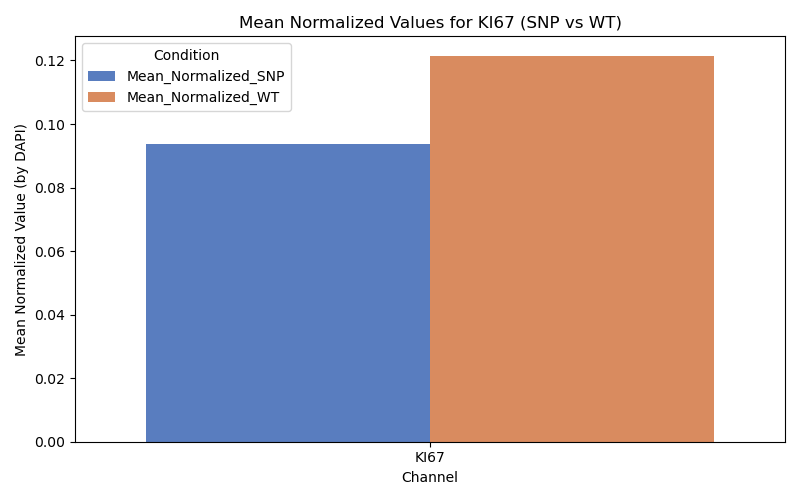

# SC00039_Final_Project_MC
## Purpose
This code were designed to analyze ND2 image files containing different channels specifically aimed to evaluate proliferation/differentiation characteristics of different lines (e.g., DAPI, KI67, SOX2, MAP2). It performs image processing tasks such as background subtraction, Otsu thresholding, and segmentation. The processed data is normalized using the DAPI channel, and statistical analysis (t-tests) is applied to determine differences between "SNP" and "WT" samples.
## Prerequisites
Before running the code, be sure that you have the following installed:

1)Conda or use an existing installation of Anaconda/Miniconda.
2)Python 3.9

## Test-data
Since ND2 image files are big, I could not manage to upload them here. Please download Image_Analysis folder contains 4 SNP and 4 WT images into your computer before running the code via Google drive link below:
>> https://drive.google.com/drive/folders/1e7LlDjyH3JKyG7Flhx9VhJ8vnMDfLowr?usp=share_link
## Installation
### Step 1: Clone the Repository
Download the project files to your local machine. You can do this by cloning the repository or downloading it as a zip.
```bash
git clone https://github.com/melocelo/SC00039_Final_Project_MC.git
```
### Step 2: Install Conda
If you don't already have Conda, install it by following the instructions at Miniconda.
## Environment Setup
In this project, we need a Conda environment so you can create the environment from the provided environment.yml file in this repository.
### Step 1: To create the environment that will be used to install Jupyter Lab.
```bash
conda create -y -n trial-env -c conda-forge python=3.9
```
### Step 2: To activate environment
When the virtual environment with the name trial-env is created, you can activate it to install the desired packages.
```bash
conda activate trial-env
```
### Step 3: To install JupyterLab and make trial-env available to JupyterLab
```bash
conda install -c conda-forge jupyterlab
ipython kernel install --user --name=trial-env
```

When the environment is activated, you can verify that the correct packages are installed via:
```bash
conda list
```
If everything is correct, you are supposed to see the required packages (like scikit-image, pandas, seaborn, nd2reader, etc.) in the list.
## Running the code 
You can run the code in terminal or in Jupyter Notebook by following these steps.
### Running in terminal
```bash
conda activate trial-env
python Final_Assignment.py
```
Before runnning the code, be sure that you are in the directory of the code.
### Running in Jupyter Notebook
```bash
conda activate trial-env
jupyter lab
```
You can open the Python script or notebook in Jupyter and run the cells to execute the analysis. However I recommend to use Jupyter since there will be many output images rather than terminal.

### Example
### Running in Jupyter Notebook
```bash
conda activate trial-env
jupyter lab
```

OR
### Running in terminal
```bash
conda activate trial-env
python Final_Assignment.py 
```

OUTPUT:





```bash

  Image Channel  Cell Count      Area  Normalized (by DAPI)
0   SNP_1    DAPI        1212       NaN              1.000000
1   SNP_1    KI67         168       NaN              0.138614
2   SNP_1    SOX2         603       NaN              0.497525
3   SNP_1    MAP2        5300  149459.0            123.316007
4   SNP_2    DAPI        1225       NaN              1.000000
5   SNP_2    KI67         229       NaN              0.186939
6   SNP_2    SOX2          54       NaN              0.044082
7   SNP_2    MAP2       12687  477062.0            389.438367
8   SNP_3    DAPI         987       NaN              1.000000
9   SNP_3    KI67          32       NaN              0.032421
10  SNP_3    SOX2         655       NaN              0.663627
11  SNP_3    MAP2       16544  803084.0            813.661601
12  SNP_4    DAPI         967       NaN              1.000000
13  SNP_4    KI67          16       NaN              0.016546
14  SNP_4    SOX2         597       NaN              0.617373
15  SNP_4    MAP2       17549  890444.0            920.831437
16   WT_1    DAPI         866       NaN              1.000000
17   WT_1    KI67         163       NaN              0.188222
18   WT_1    SOX2         589       NaN              0.680139
19   WT_1    MAP2        4957  506197.0            584.523095
20   WT_2    DAPI        1108       NaN              1.000000
21   WT_2    KI67         138       NaN              0.124549
22   WT_2    SOX2         629       NaN              0.567690
23   WT_2    MAP2        7075  703818.0            635.214801
24   WT_3    DAPI         619       NaN              1.000000
25   WT_3    KI67          42       NaN              0.067851
26   WT_3    SOX2         294       NaN              0.474960
27   WT_3    MAP2        4138  415064.0            670.539580
28   WT_4    DAPI         749       NaN              1.000000
29   WT_4    KI67          79       NaN              0.105474
30   WT_4    SOX2         370       NaN              0.493992
31   WT_4    MAP2        6671  608571.0            812.511348

T-test p-values (SNP vs WT):
KI67: 0.5847267923953332
SOX2: 0.5330019831834916
MAP2: 0.5750101888666581

Mean Summary of Cell Count, Area, and Normalized Values:
  Channel  Mean_Cell_Count_SNP  ...  Mean_Normalized_SNP  Mean_Normalized_WT
0    DAPI              1097.75  ...             1.000000            1.000000
1    KI67               111.25  ...             0.093630            0.121524
2    MAP2             13020.00  ...           561.811853          675.697206
3    SOX2               477.25  ...             0.455652            0.554195


```
